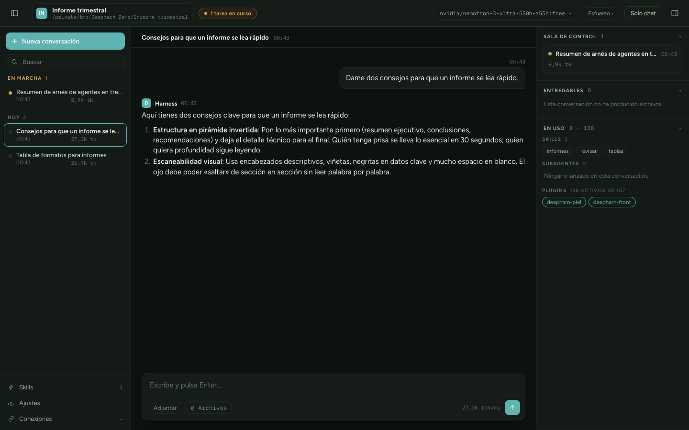
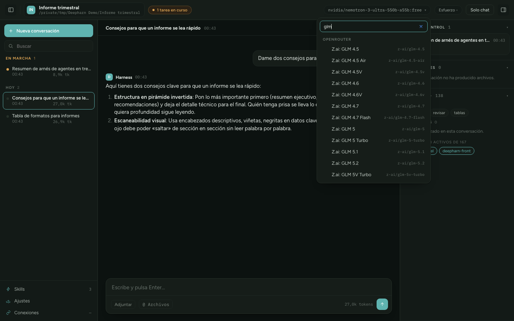
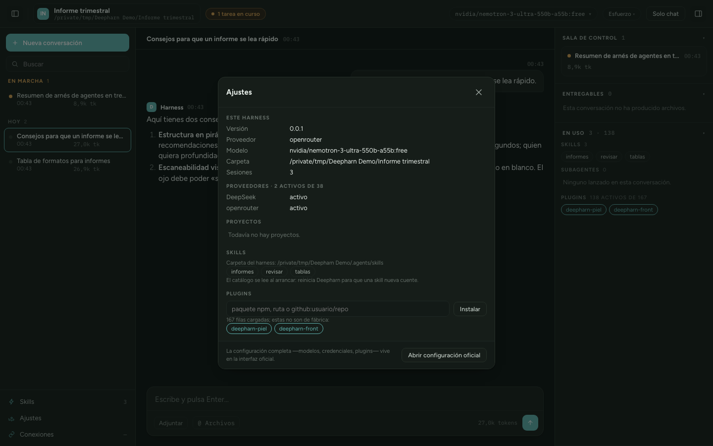
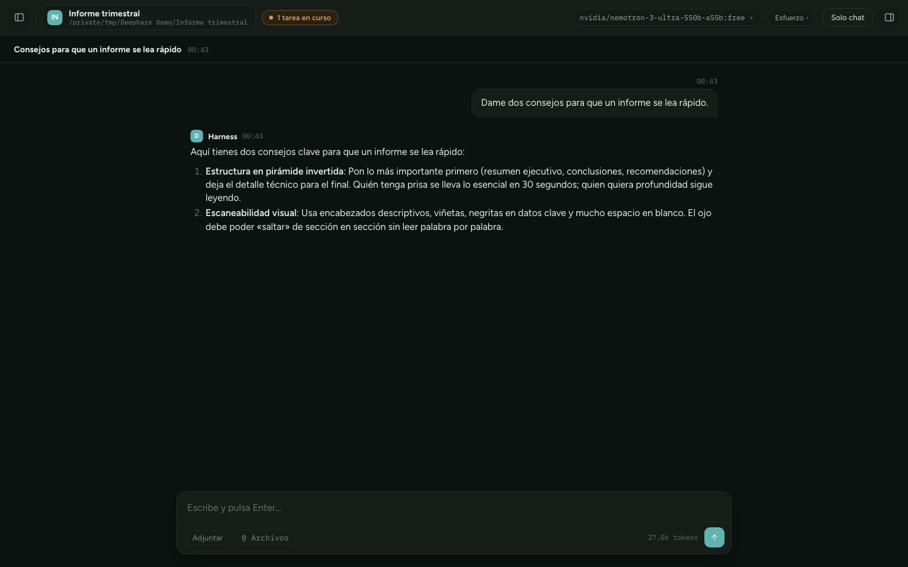

# Deepharn

**Una app de escritorio para [DeepSeek Harness](https://github.com/deepseek-ai/deepseek-harness)
en macOS, pensada para todo lo que no es programar:** escribir, investigar,
orquestar tareas y quedarte con lo que producen.


No es un tema ni un envoltorio de la interfaz oficial: es un **frontend distinto**
que habla con el harness por su API, servido desde el propio harness y metido en
una ventana nativa.



*Tres columnas plegables: conversaciones a la izquierda, el chat en medio, y a la
derecha lo que está corriendo, lo que ha producido y lo que tiene a mano.*

## Qué hace

- **Conversaciones agrupadas** en En marcha / Hoy / Antes, con su hora y sus tokens.
- **Sala de control** con lo que está corriendo, y **entregables** con los archivos
  que ha producido la conversación.
- **En uso**: qué skills ve el agente, qué subagentes ha lanzado y qué plugins
  están cargados.
- **Selector de modelo y de esfuerzo de razonamiento**, con filtro (OpenRouter
  ofrece más de cien modelos).
- **Ajustes** con instalador de plugins y gestor de skills, sin bajar a la terminal.
- **Permisos con diálogo del sistema**: cuando el agente quiere salir de su carpeta,
  la app trae el foco y te pregunta. Sin esto el turno se queda esperando en silencio.
- **Catálogo de modelos al día**: un botón trae la lista real de OpenRouter, en vez
  del catálogo enlatado del harness, que arrastra modelos retirados.
- Borrar conversaciones y proyectos, renombrarlos.
- Tres columnas plegables y modo «solo chat». Claro y oscuro.

Y cuando algo falla —modelo retirado, clave caducada, cuota agotada— **se ve**:
el error del proveedor sale en la conversación en vez de quedarse en nada.

La respuesta del agente se pinta según se escribe, y el texto se renderiza como
markdown: párrafos, viñetas, código.

## Por dentro

| | |
|---|---|
|  | **Modelo y esfuerzo.** Agrupados por proveedor y con filtro, porque OpenRouter ofrece más de cien. El esfuerzo de razonamiento sale de lo que declara cada modelo. |
|  | **Ajustes.** Proveedores activos, proyectos, skills con aviso si alguna está mal escrita, e instalador de plugins. Sin bajar a la terminal. |
|  | **Solo chat.** Un botón pliega las dos columnas y deja la conversación sola. |

## Cómo está montado

Tres piezas, cada una con un trabajo:

| Pieza | Qué es |
|---|---|
| `app/` | Concha de escritorio en Swift + WKWebView. Arranca el harness, lo vigila y lo para al salir. |
| `plugins/deepharn-front/` | Plugin de host: sirve el frontend en `/deepharn` y añade endpoints propios para instalar plugins y gestionar skills. |
| `plugins/deepharn-piel/` | Plugin de cliente: reescribe los tokens de color y tipografía de la interfaz oficial. Opcional. |

El frontend es HTML, CSS y JavaScript a pelo. Sin framework, sin compilación, sin
dependencias: se edita y se recarga.

**Por qué se sirve desde el propio harness:** su API compara el `Host` de cada
petición y rechaza lo que venga de otro puerto. Servir el frontend desde fuera no
funciona; desde dentro, las llamadas a `/api` salen gratis.

## Instalar

**Lo que necesitas:** macOS 14+ (Apple Silicon), Node 22+, pnpm, las Command Line
Tools de Xcode y el harness (`npm i -g @deepseek-ai/dsh`). Si te falta algo, el
instalador te lo dice antes de tocar nada.

```bash
git clone https://github.com/AxelGoal/Deepharn.git
cd Deepharn
./instalar.sh
```

Eso crea un perfil propio llamado `deepharn` —**no toca el que ya uses**—, instala
los dos plugins, los monta en el árbol y compila la app en `/Applications`.

Luego, desde Launchpad, o:

```bash
open -a Deepharn
```

<details>
<summary>Hacerlo a mano, paso a paso</summary>

```bash
# Un perfil propio, copiado del que ya tienes
cp -R ~/.dsh/profiles/web ~/.dsh/profiles/deepharn

# Los plugins
dsh plugin --profile deepharn add ./plugins/deepharn-front
dsh plugin --profile deepharn add ./plugins/deepharn-piel
```

Y sus filas en `~/.dsh/profiles/deepharn/cordis.patch.yml`. **Ojo con el
envoltorio `insert`**: una entrada suelta con `id:` sobrescribe una fila existente
en vez de añadir una nueva.

```yaml
- insert:
    - id: deepharn-front
      name: deepharn-front
- insert:
    - id: deepharn-piel
      name: deepharn-piel
```

Luego la app: `cd app && ./construir.sh`

También vale sin app: `dsh --profile deepharn` y abrir
`http://127.0.0.1:3081/deepharn/` en el navegador.
</details>

### Desinstalar

```bash
rm -rf ~/.dsh/profiles/deepharn /Applications/Deepharn.app
```

Nada más. El perfil que ya usabas queda intacto, y tus conversaciones también:
viven en `~/.dsh/sessions`, fuera del perfil.

## Dónde puede escribir el agente

El directorio donde arranca el harness **es** el espacio de trabajo del agente, y
con la política `workspace-write` eso es exactamente lo que puede tocar sin
pedirte permiso. Por eso la app arranca en **`~/Deepharn`**, una carpeta suya que
se crea sola: ahí trabaja libre, y para cualquier cosa fuera de ahí te pregunta.

Merece la pena saberlo antes de cambiarlo: arrancar el harness en tu carpeta
personal le da permiso de escritura sobre todo lo que hay en ella.

## Cómo arranca

Abrir la app es lo único que hay que hacer:

1. Comprueba los puertos 3081-3083, preguntando por **su propio endpoint** y no
   solo si el puerto responde — así no se engancha a un harness ajeno.
2. Si lo encuentra, se engancha y no arranca nada. Al cerrarla, ese servidor
   sigue vivo.
3. Si no hay nada, lo lanza: `dsh` instalado, la caché de npx, o
   `npx -y @deepseek-ai/dsh`.
4. Si falla, dice por qué, enseña el registro y ofrece reintentar.
5. Al salir, para el harness solo si lo arrancó ella.

## Lo que aprendimos por el camino

Está en [COMO-ESTA-HECHO.md](COMO-ESTA-HECHO.md): la API del harness, sus métodos
y sus trampas. Si vas a construir algo parecido, ahí tienes el mapa.

## Qué ejecuta y con qué límites

Deepharn lanza procesos, así que conviene decir cuáles y por qué —los escáneres
automáticos del ecosistema lo marcan, y con razón:

- **`dsh` como proceso hijo.** La app arranca el harness al abrirse y lo para al
  salir. Si ya había uno sirviendo, se engancha y no mata nada al cerrarse.
- **`dsh plugin add`**, solo cuando pulsas *Instalar* en Ajustes, con el paquete
  que hayas escrito. Rechaza nombres con caracteres de shell y no usa intérprete.

Los endpoints propios (`/deepharn/api/…`) viven dentro del servidor del harness,
que **solo escucha en `127.0.0.1`**. Ese servidor no tiene autenticación, así que
tampoco la tienen: quien pueda ejecutar código en tu Mac ya podía hacer lo mismo
por otras vías. No expongas el puerto a la red.

Y lo que de verdad decide qué puede tocar el agente no es esto, sino su espacio
de trabajo — el apartado de arriba.

## Trastear

El frontend está en `plugins/deepharn-front/web/`: tres archivos, sin compilación.
Se edita y se recarga con ⌘R. Si tocas la mitad de servidor (`lib/`), reinicia el
harness con ⇧⌘R.

La piel —colores y tipografías— está en `plugins/deepharn-piel/src/piel.css`; tras
editarla, `node construir.mjs` la reensambla.

Si algo no aparece: el harness compone su árbol **al arrancar**, así que los
plugins y las skills nuevas piden reinicio.

## Estado

Funciona y se usa a diario, pero es joven y el harness que hay debajo está en
*developer preview*, así que rompe compatibilidad de vez en cuando.

**Lo que falta:** que la respuesta se escriba letra a letra —los WebSocket ya
están conectados para los permisos, falta usarlos también para el texto— y
adjuntar archivos.

## Licencia

MIT.
